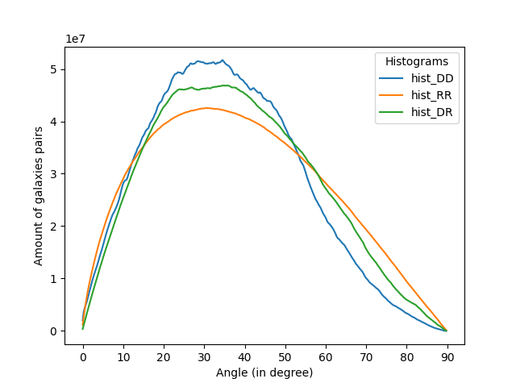
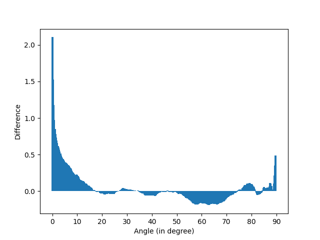

# GPU Programming

This program aims to show the difference between a list of real galaxies coordinates and a random distributed one. For that we use **CUDA** parallel programming to increase the time effienciency of our method.

We compute in parallel the angles between 2 pairs of galaxies (real-random, real-real or random-random).

Results are written in a CSV file and then displayed with plots using a python script `plots.py`.

## Run GPU computation

```bash
./run.sh
```

Results are in `omega.out`.

## Run results plots script

Install Python dependencies

```bash
python3 -m venv .env
source .env/bin/activate
pip install --upgrade pip
pip install pandas matplotlib
```

Run script

```bash
python3 plots.py
```

## Results

Output from `out.txt`:

```
   Found 4 CUDA devices
      Device Tesla V100-PCIE-16GB                  device 0
         compute capability            =        7.0
         totalGlobalMemory             =       16.95 GB
         l2CacheSize                   =    6291456 B
         regsPerBlock                  =      65536
         multiProcessorCount           =         80
         maxThreadsPerMultiprocessor   =       2048
         sharedMemPerBlock             =      49152 B
         warpSize                      =         32
         clockRate                     =    1380.00 MHz
         maxThreadsPerBlock            =       1024
         asyncEngineCount              =          7
         f to lf performance ratio     =          2
         maxGridSize                   =   2147483647 x 65535 x 65535
         maxThreadsDim in thread block =   1024 x 1024 x 64
         concurrentKernels             =        yes
         deviceOverlap                 =          1
            Concurrently copy memory/execute kernel
      Device Tesla V100-PCIE-16GB                  device 1
         compute capability            =        7.0
         totalGlobalMemory             =       16.95 GB
         l2CacheSize                   =    6291456 B
         regsPerBlock                  =      65536
         multiProcessorCount           =         80
         maxThreadsPerMultiprocessor   =       2048
         sharedMemPerBlock             =      49152 B
         warpSize                      =         32
         clockRate                     =    1380.00 MHz
         maxThreadsPerBlock            =       1024
         asyncEngineCount              =          7
         f to lf performance ratio     =          2
         maxGridSize                   =   2147483647 x 65535 x 65535
         maxThreadsDim in thread block =   1024 x 1024 x 64
         concurrentKernels             =        yes
         deviceOverlap                 =          1
            Concurrently copy memory/execute kernel
      Device Tesla V100-PCIE-16GB                  device 2
         compute capability            =        7.0
         totalGlobalMemory             =       16.95 GB
         l2CacheSize                   =    6291456 B
         regsPerBlock                  =      65536
         multiProcessorCount           =         80
         maxThreadsPerMultiprocessor   =       2048
         sharedMemPerBlock             =      49152 B
         warpSize                      =         32
         clockRate                     =    1380.00 MHz
         maxThreadsPerBlock            =       1024
         asyncEngineCount              =          7
         f to lf performance ratio     =          2
         maxGridSize                   =   2147483647 x 65535 x 65535
         maxThreadsDim in thread block =   1024 x 1024 x 64
         concurrentKernels             =        yes
         deviceOverlap                 =          1
            Concurrently copy memory/execute kernel
      Device Tesla V100-PCIE-16GB                  device 3
         compute capability            =        7.0
         totalGlobalMemory             =       16.95 GB
         l2CacheSize                   =    6291456 B
         regsPerBlock                  =      65536
         multiProcessorCount           =         80
         maxThreadsPerMultiprocessor   =       2048
         sharedMemPerBlock             =      49152 B
         warpSize                      =         32
         clockRate                     =    1380.00 MHz
         maxThreadsPerBlock            =       1024
         asyncEngineCount              =          7
         f to lf performance ratio     =          2
         maxGridSize                   =   2147483647 x 65535 x 65535
         maxThreadsDim in thread block =   1024 x 1024 x 64
         concurrentKernels             =        yes
         deviceOverlap                 =          1
            Concurrently copy memory/execute kernel
   Using CUDA device 0

   Assuming input data is given in arc minutes!
   data_100k_arcmin.dat contains 100000 galaxies
   rand_100k_arcmin.dat contains 100000 galaxies

Histogram DD sum: 10000000000
Histogram DR sum: 10000000000
Histogram RR sum: 10000000000

Time: 3.833807s
```

The program made all the computations in **3.833807 seconds**.

I plotted the histogram results in two plots:

- DD, RR and DR histograms



- Omega values



## Conclusion

If we look at the omega plot, most of the difference is from the first angle bins. The difference isn't uniform so the galaxy distribution is not random. There are galaxy clusters.

I only got angles between 0 and 90° so maybe bins until 180° aren't needed.

